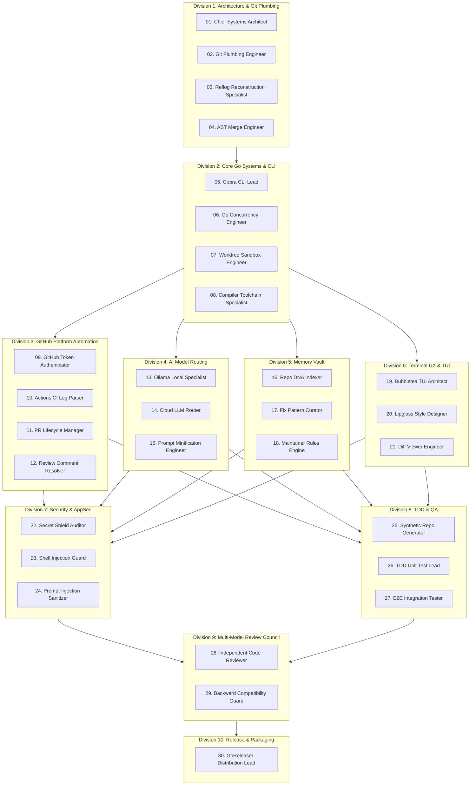

# 🏛️ GitClaw Multi-Agent Builder Organization

**Classification:** Dedicated Construction Harness for GitClaw  
**Catalog Size:** 30 Specialized Builder Agents across 10 Engineering Divisions  
**Harness Protocol:** Directed Acyclic Graph (DAG) + Parallel Review Council  

---

## 1. The 10 Engineering Divisions Org Chart

---

## 2. Directory of all 30 Builder Agents

| # | Agent Name | Division | Primary Responsibility |
| :---: | :--- | :--- | :--- |
| **01** | `01_chief_architect` | Architecture | System boundaries, package layouts (`pkg/`, `cmd/`), interface abstractions. |
| **02** | `02_git_plumbing_engineer` | Git Plumbing | Low-level Git object parsing (`.git/objects`), commit graphs, and packfiles. |
| **03** | `03_reflog_specialist` | Git Plumbing | `git reflog` parsing, dangling commit tree scanning (`fsck`), recovery math. |
| **04** | `04_ast_merge_engineer` | Git Plumbing | 3-way AST conflict hunk parser (`<<<<<<< HEAD`, `=======`, `>>>>>>>`). |
| **05** | `05_cobra_cli_lead` | Core Go CLI | Cobra command tree (`root`, `undo`, `resolve`, `fix-ci`, `work`, `clean`). |
| **06** | `06_go_concurrency_lead` | Core Go CLI | Worker pools, channels, non-blocking I/O, and `context.Context` timeouts. |
| **07** | `07_worktree_sandbox_lead`| Core Go CLI | Dynamic Git worktree creation, isolation, lock management, and cleanup. |
| **08** | `08_compiler_specialist` | Core Go CLI | Go 1.22+ toolchain, CGo, module checksums, and `go.mod` dependency trees. |
| **09** | `09_github_auth_lead` | GitHub Automation | `gh` CLI token extraction, system keyring integration, zero-config auth. |
| **10** | `10_ci_log_parser` | GitHub Automation | `gh run view --log-failed` stream parsing, regex stack trace extractor. |
| **11** | `11_pr_lifecycle_lead` | GitHub Automation | Automated PR creation, issue linking (`Closes #id`), and auto-merge coordinator. |
| **12** | `12_review_comment_resolver`| GitHub Automation| Ingests inline PR comments, maps line offsets, and applies diff replies. |
| **13** | `13_ollama_local_specialist`| AI Routing | Local Ollama REST client (`qwen2.5-coder`, `deepseek-r1`), keep-alive config. |
| **14** | `14_cloud_llm_router` | AI Routing | Groq, DeepSeek, and OpenAI-compatible streaming API clients with retries. |
| **15** | `15_prompt_minifier` | AI Routing | Token budgeting (<1,000 tokens), AST hunk minification, and prompt caching. |
| **16** | `16_repo_dna_indexer` | Memory Vault | Ingests repository conventions, build commands, and protected file paths. |
| **17** | `17_fix_pattern_curator` | Memory Vault | Problem-solution vector store, logarithmic confidence scoring, decay math. |
| **18** | `18_maintainer_rules_engine`| Memory Vault | Team review preference memory and rule enforcement. |
| **19** | `19_bubbletea_architect` | Terminal UX | Bubbletea event loops, model state machines, non-blocking render cycles. |
| **20** | `20_lipgloss_designer` | Terminal UX | Dark-mode color palettes (Sky Blue, Emerald, Slate), border styling. |
| **21** | `21_diff_viewer_engineer` | Terminal UX | Side-by-side and unified colorized 3-way conflict diff visualizer. |
| **22** | `22_secret_shield_auditor` | Security & AppSec | 50+ regex pattern scanner (AWS, GitHub, Stripe, OpenAI, `.env`). |
| **23** | `23_shell_injection_guard` | Security & AppSec | Subprocess command parameter slicing (`os/exec`) and sanitization. |
| **24** | `24_prompt_injection_guard`| Security & AppSec | Escaping untrusted GitHub issue and comment inputs. |
| **25** | `25_synthetic_repo_gen` | TDD & QA | Creates disposable dirty git repos, conflicts, and corrupted branches. |
| **26** | `26_tdd_unit_test_lead` | TDD & QA | Table-driven Go unit tests (`_test.go`) with strict branch coverage. |
| **27** | `27_e2e_integration_lead` | TDD & QA | End-to-end command testing (`undo`, `resolve`, `fix-ci`, `work`). |
| **28** | `28_code_reviewer` | Review Council | Fresh-context reviewer auditing memory leaks, dead code, and style. |
| **29** | `29_backward_compat_guard`| Review Council | Exported symbol stability and CLI flag deprecation protector. |
| **30** | `30_goreleaser_lead` | Release & Packaging| Multi-OS binary cross-compilation (Windows `.exe`, macOS, Linux) & releases. |
